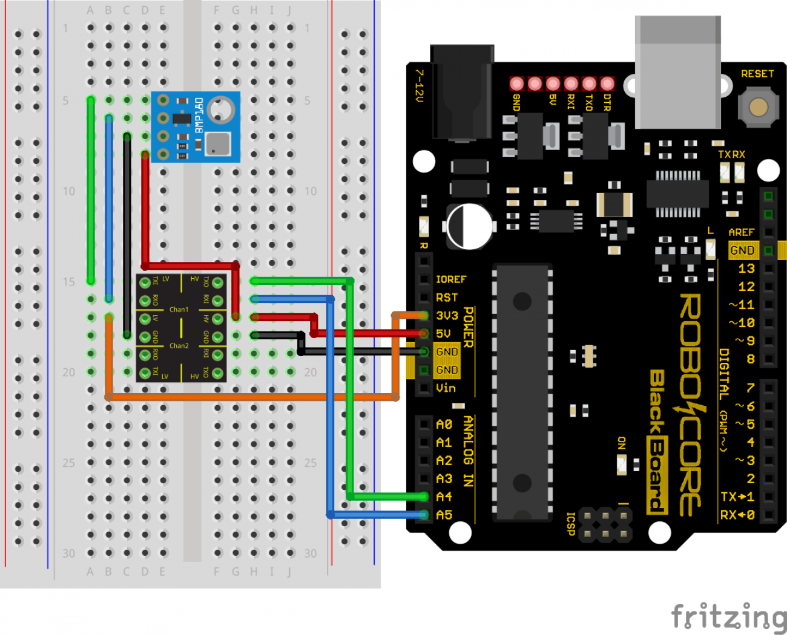

# Matheus I

Este projeto é um case trainee do processo seletivo para se tornar membro do Ramo Estudantil do Cefet-RJ, IEEE. Neste case nossa equipe tem o objetivo de construir um foguete cujo apogeu alcance os 200m de altitude. Utilizando-se todas as subáreas que compoem o foguetemodelismo, simulamos, projetamos e construimos esse foguete que denominamos "Matheus I".

### Eletrônica

A eletrônica do foguete tem como 2 objetivos, o primeiro é fazer a com que os dados de voo sejam processados e armazenados, para isso utiliza-se sensores, no caso deste projeto, especificamente o BMP 180, que nada mais é do que um barômetro cuja função é medir temperatura e pressão atmosférica.
O segundo objetivo da eletrônica é garantir que a recuperação do foguete seja ativada, está parta é de extrema importância pois a única coisa que difere um foguete de um míssel, é o fator recuperação estar em funcionamento ou não.

- Arduino Pro Mini
- Board RocketWolf
- Islanded phenolite board
- Leitor de micro SD
- Buzzer
- Interruptor
- Rele
- Bateria 9v x 2
- 9v battery adapter
- Light switch
- Jumpers

 
 

### Aerodinâmica

A aerodinâmica do foguete tem o intuito de torna-lo estável, fazendo com que sua trajetória mantenha um ângulo de 90° graus em relação ao solo, para que dessa maneira seja possível alcançar o apogeu, e concluir a missão.
Para isso, é utilizado um software de simulação denominado Open Rocket, além de ser necessário alguns conhecimentos referentes aos valores da estabilidade, configurações de aletas e configuração da coifa.

 
 

### Estrutura

Tem o objetivo de constituir, construir e unir todas as partes que compõem o foguete, indo desde a modelagem até a construção e decisão de materiais a serem utilizados no projeto, sendo de extrema importância em diversas outras subáreas do foguetemodelismo.

 
 

### Recuperação

A recuperação torna possível a reaquisição do projeto, além de fazer com que a queda do foguete seja controlada após a queima total do propelente. Portanto, é de extrema importância que a recuperação seja efetiva, para que o foguete não se torne um míssel.

 
 

### Propulsão

Texto sobre propulsão

 
 

---

 

